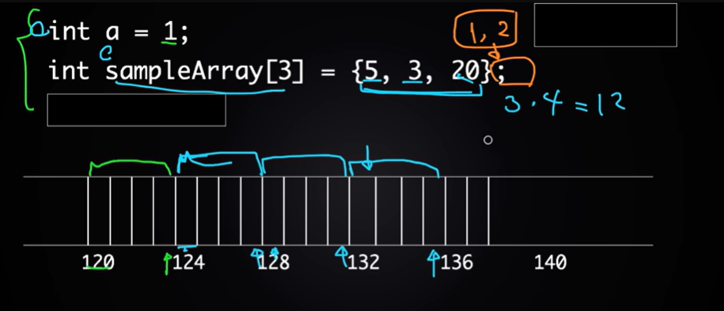

What is an Array?
    Collection of items of a single type
    Example:
        Array of Integers [1,-2,300]
        Array of Strings ["Apple","Banana","Cherry"]
    It's not usual for an array to have multiple types

    Syntax:
    Int[] sampleArray = new Int[5];
    sampleArray = {1,2,3,4,5};

Visualize the array as a box with 5 slots

    [1] [2] [3] [4] [5]

If we want to change some of the value in this array we can use something like below

    sampleArray[0] = 10;
    sampleArray[1] = 20;
    
Atfer the changes sample array will look this below.Only 2 elements have been changed not the other elements

    [10] [20] [3] [4] [5]

Index of the Arrays starts from 0

    [0] [1] [2] [3] [4]

What if we try to add 2 more elements to the array?
        Let's say you want to add 2 and 3 values to the array. Why don't we add 2 more slots in the array and add these values like below?

    [10] [20] [3] [4] [5] [2] [3]

We Can't add more elements to the array because it is fixed size.

How Memory works on a computer?

There are 2 mainly 2 mechanisnm for storing data in the computer

1.Memory(RAM)
2.Storage(Hard Disk /Flash Drive)

Data on Storage is permanent
    Example: Bunch photos stored in your laptop
Data on Memory is temporary
    Example: Drawing something on the computer and when the computer chrashes the files which are not saved will not be available

Retriving the data from memory is faster than retriving the data from storage
    Example: Retriving a file from your draw of your table is slower than retriving a file from your table/desk.

Applications are stored on Storage and run on Memory
    Example: Google chrome are available in storage and when we launch it the browser tabs are loaded on memory(u can check the applications which are currently used by RAM in task manager)

How is Memory and Storage related to Arrays?

    int a = 1 ;

When you compile and execute this code a variable is created and integer 1 is created and stored on the Memory(RAM)

How integers are stored on memory exacctly?
    Each integer when stored on a computer it often expressed as 32 bits of ones and zeros

    Example:
        1 is stored as 00000000000000000000000000000001
        2 is stored as 00000000000000000000000000000010
        3 is stored as 00000000000000000000000000000011
        
Memory can be thought of as a long tape of bytes (a small unit of data = 8 bits)

Each Compartment in this tape is called as a byte.Each of it will have 8 bits of data.

We can store 2 bytes of data in 2 bytes of memory and retrive 2 bytes of data from memory.Computer achives it by assigning address to each byte.And each of it is represented by a single integer and it is decided by the operating system.

We can't store 2 bytes of data in 1 byte of memory and retrive 2 bytes of data from memory.

We can't store 1 byte of data in 2 bytes of memory and retrive 1 byte of data from memory.

How to store an array of integers in memory?
    Let's say we want to store an array of 3 integers in memory.
    We need 3 * 4 = 12 bytes of memory to store the array.
    We can store the array in memory by assigning address to each integer.

    The memory representation is given in the image below green color is the space occupied by integer a and blue color is the space occupied by the array
    

We can't add more elements to the array because it is fixed size. If you want to add more elements it's better to create a new array with the new size and copy the elements from the old array to the new array.
