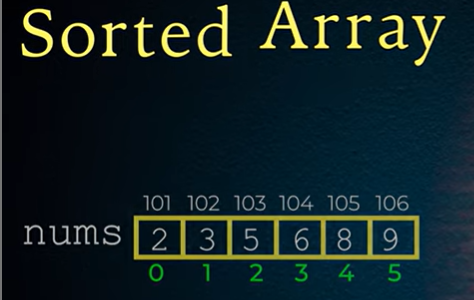
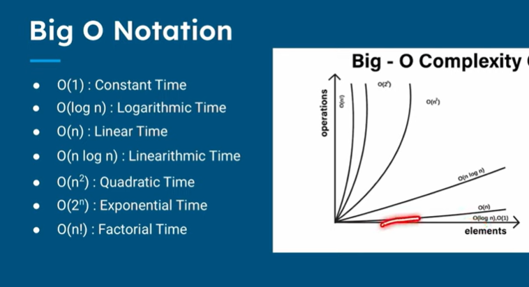

When we have a problem we have lot's solutions to that problem and that is algorithm.

Run the Application with less memory and less time.We have to analyse the algorithm to make it more efficient.

Once you got a solution we have to work on the optimization of the algorithm.

Optimization is nothing but making the algorithm more efficient.

We have two types of optimization:
    1. Time Optimization
    2. Space Optimization

Time Optimization : Less Time
Space Optimization :Less Memory

We will check with an Sorted Array example.

I want to find a element in the array

    There are multiple ways to do it.
    1. Linear Search
    2. Binary Search

Linear Search
    [5, 7, 10, 12, 15, 20, 25, 30, 35, 40] target  12
    I want to search 12
    What we do is we go one by one and check if the element is equal to the target in a sequential order.
    5 == 12 ? No
    7 == 12 ? No
    10 == 12 ? No
    12 == 12 ? Yes
    So we found the element at index 3.

Now we have a problem what if the element is not present in the array?
    [5, 7, 10, 12, 15, 20, 25, 30, 35, 40] target  100
    5 == 100 ? No
    7 == 100 ? No
    10 == 100 ? No
    12 == 100 ? No
    15 == 100 ? No
    20 == 100 ? No
    25 == 100 ? No
    30 == 100 ? No
    35 == 100 ? No
    40 == 100 ? No
    So we didn't find the element in the array and we have to iterate through the entire array.

As our size of array increases the time taken and steps to find the element also increases.
    
    Pseudocode for Linear Search:
        function linearSearch(array, target):
            for i from 0 to length(array) - 1:
                if array[i] == target:
                    return i
            return -1
Code is small but the amount of time it takes to run is large.

Binary Search
    [5, 7, 10, 12, 15, 20, 25, 30, 35, 40] target  12
    I want to search 12
        We divide the array into 2 parts - > Using mid value = Start + End / 2
        Start = 0, End = 9
        Mid = 0 + 9 / 2 = 4
        Array[4] = 15
        15 == 12 ? No
        15 > 12 ? Yes
        So we go to the left part of the array
        Start = 0, End = 4
        Mid = 0 + 4 / 2 = 2
        Array[2] = 10
        10 == 12 ? No
        10 < 12 ? Yes
        So we go to the right part of the array
        Start = 2, End = 4
        Mid = 2 + 4 / 2 = 3
        Array[3] = 12
        12 == 12 ? Yes
        So we found the element at index 3.   

At the start itself we removed half of the array. So number of operations we do here is less than the linear search.

Pseudocode for Binary Search:

        function binarySearch(array, target):
            start = 0
            end = length(array) - 1
            while start <= end:
                mid = start + end / 2
                    if array[mid] == target:
                        return mid
                    else if array[mid] < target:
                        start = mid + 1
                    else:
                        end = mid - 1
                return -1

Time Complexity
    Measure of how the running time of an algorithm increases as the size of the input increases.
    It is denoted by O(n).
    
Big O Notation
    Concept to understand the time complexity of an algorithm.

    O(1) -> Constant Time
    O(log n) -> Logarithmic Time
    O(n) -> Linear Time
    O(n log n) -> Log-Linear Time/Linearithmic Time
    O(n^2) -> Quadratic Time
    O(2^n) -> Exponential Time
    O(n!) -> Factorial Time

In Linear Search when we have 5 values we take 5 steps to find the element.If it is 10 values we take 10 steps.We have to go for the worst case scenario.
    So it is O(n)

If we want to read any element in the array with index value we can directly access it.It's constant time.
    Example : array[5]
    So it is O(1)

In Binary Search as Number increases it will not directly increase the number of steps.Consider it takes 3 steps what if the data value double like 7 to 14.It may omly take extra one step.At the start itself we will take only half of the array.
    So it is O(log n) (Between O(1) and O(n))

In Merge Sort we divide the array into 2 parts and then sort them. So it is O(n log n)

In Bubble Sort we compare the adjacent elements and swap them if they are in the wrong order. So it is O(n^2)

In Fibonacci Series we have to calculate the previous two numbers to calculate the current number. So it is O(2^n)

In Factorial we have to calculate the previous number to calculate the current number. So it is O(n!)

